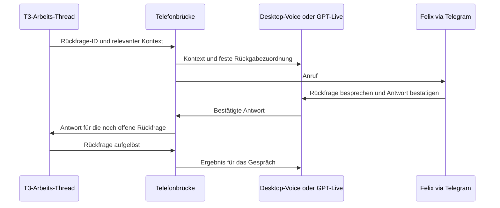

# T3-Threads, Telefonthread und GPT-Live

Stand: 11. September 2026. Der Nutzer hat **GPT-Live 1 direkt über die API** gewählt, die genannten Zusatzkosten akzeptiert und einen eigenen Projekt-Key bereitgestellt. Die frühere Bindung an Original-Desktop-Voice ist damit ersetzt. BlackHole wurde nicht installiert.

## Implementierter und geprüfter Stand

- `native/pcm_audio.cpp` verbindet echte WebRTC-Audio-Callbacks mit dem PCM-Strom der Live-API. Ein echtes Telegram-/GPT-Live-Gespräch wurde vom Nutzer bestätigt.
- `telegram_bridge/t3.py` verwendet die vorhandenen T3-HTTP-Schnittstellen, erzeugt einen separaten Gesprächs-Thread mit dem Provider des Arbeits-Threads und gibt bestätigte Antworten gezielt zurück. Ein realer T3-Integrationstest mit synthetischem Gesprächstranskript wurde erfolgreich durchgeführt; Quelle und Koordinator wurden danach archiviert.
- Neue Nutzeraussagen während der Backend-Arbeit machen eine aus dem älteren Transkript abgeleitete Antwort ungültig. Die Brücke prüft außerdem die weiterhin offene Rückfrage, deren Inhalt und die feste Thread-/Projekt-Zuordnung.
- `watch-t3` ist als begrenzter Projektwächter mit persistenter Vermeidung doppelter Anrufversuche implementiert. Seine Auswahl- und Wiederanlauflogik wurde offline getestet. Der begrenzte PeakShare-Pilot mit drei Minuten Wartezeit wurde auf Nutzerwunsch wieder pausiert. Der automatische Ablauf wird zunächst in einem getrennten Demo-Projekt geprüft. Ein dauerhaft installierter Dienst ist weiterhin nicht eingerichtet.
- 100 Offline-Tests bestehen. Die manuell gestartete Gesamtprobe mit echter Telefonantwort, Korrektur von Blau auf Grün, T3-Rückgabe und gesprochenem Auflegen war erfolgreich. Der automatische Hintergrundbetrieb bleibt noch gesondert zu erproben. Die folgenden Abschnitte enthalten außerdem den zuvor durchgeführten Variantenvergleich.

## Aufgaben bleiben in T3

T3 verwaltet weiterhin den Arbeits-Thread und dessen Provider-Sitzung. Für eine Rückfrage übergeben wir einen kleinen Kontextauszug mit T3-Thread-ID, Projekt-ID und Rückfrage-ID an den Gesprächsteil. Bei Desktop-Voice kann das ein eigener Codex-Telefonthread sein; mit GPT-Live ist es eine Live-Sitzung mit Client-Delegation.

Dies ist keine zweite gleichzeitige Ausführung desselben Codex-Threads. Die Telefonseite erklärt und sammelt die Antwort; Projektarbeit und Provider-Lifecycle bleiben bei T3. Ausgaben aus Repository oder Thread sind Kontextdaten und verleihen der Telefonseite keine zusätzlichen Berechtigungen.

## Im lokalen T3-Code geprüfte Schnittstellen

- `GET /api/orchestration/threads/:threadId`: einzelner Thread-Snapshot.
- `POST /api/orchestration/dispatch`: typisierter Befehl.
- `thread.user-input.respond`: Antwort auf eine konkrete offene Rückfrage über `threadId`, `requestId`, `answers`, `commandId`, `createdAt`.
- `thread.turn.start`: möglicher späterer Rückkanal für frei formulierte Folgeaufträge, die keine wartende Rückfrage beantworten. Dies ist ein gesonderter Vorgang und wird nicht als automatischer Ersatz für eine veraltete Rückfrage benutzt.
- Rechte: `orchestration:read` und `orchestration:operate`; eigener T3-Zugang ist von einem OpenAI-API-Key getrennt.

Geprüfte lokale Quellen im Repository `t3code`, Revision `a04198127`: `packages/contracts/src/environmentHttp.ts`, `packages/contracts/src/orchestration.ts`, `apps/server/src/orchestration/http.ts`, `apps/server/src/orchestration/Layers/ProviderRuntimeIngestion.ts` und `apps/server/src/provider/Layers/CodexSessionRuntime.ts`. Der Servercode wurde nicht verändert; die HTTP-Anbindung wurde gegen den laufenden Server mit isolierten Test-Threads geprüft. Keine direkten Schreibzugriffe auf dessen SQLite-Datenbank.

`telegram_bridge/handoff.py` bereitet die Kontextübergabe und den tatsächlichen T3-Antwortbefehl vor. Falscher Thread, geänderte oder erledigte Rückfrage, falsche Antwortfelder und nicht bestätigte Antworten werden abgelehnt. Eine wiederholte Vorbereitung derselben Antwort hat eine stabile Command-ID; für einen Transport-Retry wird der vollständige ursprüngliche Befehl wiederverwendet. `t3.py` übernimmt Transport und Auswertung von `user-input.resolved` beziehungsweise Provider-Fehlern. Ein Dispatch-Receipt allein wird nicht als erfolgreiche Rückgabe ausgegeben. Texttranskripte einer verbundenen T3-Rückfrage werden als Kontext im T3-Gesprächs-Thread gespeichert; Audiosamples und API-Keys gehören nicht in diese Nachrichten.

## GPT-Live 1 und Abos

GPT-Live 1 ist offiziell dokumentiert. Es kann gleichzeitig zuhören und sprechen und Arbeit an einen Backend-Agenten delegieren. Mit Client-Delegation können wir den bestehenden T3-Agenten verwenden, statt eine neue Responses-API-Sitzung für dieselbe Projektarbeit zu starten. Dafür muss die Brücke den Gesprächskontext selbst führen; ein Delegationsevent enthält nicht automatisch den Wortlaut der Nutzeranfrage. Quellen: [Modell](https://developers.openai.com/api/docs/models/gpt-live-1), [Client-Delegation](https://developers.openai.com/api/docs/guides/live-delegation).

Die offizielle Desktop-Voice-Funktion nutzt ebenfalls GPT-Live und ist abhängig von Abo, Rollout und Workspace verfügbar. Der lokale Codex-Login weist `pro` aus; daraus lässt sich die genaue Pro-Stufe oder das noch verfügbare Voice-Kontingent nicht ablesen. Laut aktueller Dokumentation hat Pro 5x ungefähr 1 bis 2,5 Voice-Stunden je rollierendem Fünfstundenfenster, Pro 20x unbegrenzten Voice-Zugang. Codex-Aufgaben verbrauchen weiterhin ihr eigenes Nutzungsbudget. Quellen: [Desktop-Voice](https://learn.chatgpt.com/docs/features/voice), [Voice-Limits](https://learn.chatgpt.com/docs/pricing#chatgpt-voice-in-desktop).

Für die direkte API benötigt die Anwendung einen OpenAI-Projekt-API-Key. GPT-Live 1 kostet aktuell 0,05 US-Dollar je aktiver Sitzungsminute, sekundengenau: 10 Minuten 0,50 US-Dollar, eine Stunde 3 US-Dollar. Wartezeit innerhalb einer offenen Sitzung zählt mit. Zusätzliche Responses-Modelle und Tools werden separat berechnet, wenn wir sie tatsächlich über die API verwenden. Der Voice-API-Verbrauch wird nicht aus dem Desktop-Voice-Abo genommen. Quellen: [API-Einstieg und Authentifizierung](https://developers.openai.com/api/docs/guides/live), [Preise](https://developers.openai.com/api/docs/pricing), [Sitzungsdauer](https://developers.openai.com/api/docs/guides/voice-latency-cost#voice-session-costs).

## Zwei mögliche Audiowege

| Weg | Zugang | Audiotechnik | Noch zu bauen |
| --- | --- | --- | --- |
| Original-Desktop-Voice | Vorhandenes Pro-Abo, kein zusätzlicher OpenAI-API-Key | BlackHole für Telegram zum Codex-Mikrofon; Core Audio Tap für Codex zurück zu Telegram | Capture, zuverlässiger Voice-Start/-Stop, eigener Telefonthread, T3-Rückgabe |
| GPT-Live 1 direkt, gewählt | OpenAI-API-Key, zusätzliche Voice-Nutzung | PCM-Audio zwischen Telegram-Medienbackend und Live-WebSocket; kein virtuelles macOS-Audiogerät erforderlich | PCM, Live-Client, Client-Delegation und T3-Rückgabe implementiert; manuell gestarteter Gesamt-Live-Test erfolgreich; Hintergrundbetrieb noch offen |

Technische Empfehlung für vollständig automatische Anrufe und inzwischen gewählter Weg: GPT-Live direkt. Das ist eine Architekturentscheidung aufgrund der dokumentierten Steuerung und Audioevents, kein gemessener Qualitätsvergleich mit Desktop-Voice. Das direkte Gespräch ist inzwischen qualitativ bestätigt; systematische Latenz-, Unterbrechungs- und Langzeittests bleiben offen.

Die API kann unter anderem Mono-PCM16 mit 16 kHz verwenden. Genau dieses Format nutzt die implementierte Verbindung zum nativen Telegram-Adapter; eine eigene Abtastratenkonvertierung zwischen diesen beiden Schnittstellen ist damit nicht erforderlich. Quellen: [Live-WebSocket](https://developers.openai.com/api/docs/guides/voice-websockets?api=live), eigene `native/media_runtime.cpp` und `native/pcm_audio.cpp`.

## Muss der Arbeits-Thread die Telefonbrücke kennen?

Nein. Ein Thread stellt eine strukturierte T3-Nutzerrückfrage über das normale Ask-Feature. Der externe Wächter erkennt diese Frage, wartet bei ausbleibender Antwort und gibt die bestätigte Telefonantwort an dieselbe Rückfrage-ID zurück. Dafür benötigt der Arbeits-Thread weder einen Telefon-API-Key noch Anrufcode oder besondere Brückenanweisungen. Die Antwort kommt bei seinem bestehenden Provider als gewöhnliche Nutzereingabe an.

Reine Fragen in normalem Nachrichtentext erzeugen dieses Ereignis nicht. Berechtigungsfreigaben sind ebenfalls ein eigener Vorgang. Der auf Nutzerwunsch geprüfte laufende PeakShare-Thread wurde nicht umprogrammiert oder durch eine zusätzliche Brückennachricht beeinflusst; in seinem sichtbaren Verlauf gab es keine explizite Information zur Telefonbrücke.

## Rückfragen sind keine Entscheidungen

Die automatische Demo-Probe hat einen Fehler offengelegt: Felix wählte weder CSV noch PDF, sondern fragte nach dem gemeinten Bericht. Diese Rückfrage wurde zwar korrekt als Nutzereingabe an die ursprüngliche Ask-ID geliefert, aber die Brücke behandelte die native Empfangsbestätigung zu pauschal als fachlichen Abschluss. Der Arbeits-Thread meldete ausdrücklich, dass die Formatentscheidung offen blieb. Seine Reaktion wurde damals nicht zurück ins Telefonat übernommen.

Der Koordinator muss nun `intent: clarification` und `intent: decision` ausdrücklich unterscheiden. Eine explizite Rückfrage braucht keine zusätzliche A/B-Bestätigung; bei einer Entscheidung bleibt die Bestätigung nach Vorlesen erforderlich. Nach einer Rückfrage liest die Brücke die echte Reaktion des Arbeits-Threads. Neue Ask-IDs werden im bestehenden Gespräch übernommen und im Anrufprotokoll als bereits behandelte Fragen vermerkt. Falls der ursprüngliche Turn ohne neue Ask-Frage endet, wird eine weitere bestätigte Eingabe als normaler Folge-Turn mit den vorhandenen Laufzeit- und Interaktionsmodi gesendet. Ein unterbrochener Turn wird dadurch nicht neu gestartet.

Ein echter T3-Regressionstest mit synthetischen Gesprächseingaben durchlief Rückfrage, Erläuterung des Arbeits-Threads, neue Ask-ID und abschließende Entscheidung für PDF. Die neue Rückfragenkette wurde anschließend telefonisch bis zur Erläuterung des Arbeits-Threads, Übernahme einer neuen Ask-ID und gesprochenem Auflegen geprüft. Eine endgültige Formatentscheidung kam in diesem Anruf nicht an; die neue Frage bleibt offen. Die abschließende Entscheidung nach Klärung ist weiterhin durch den synthetischen T3-Regressionstest belegt.

Der Nutzer hat die telefonische Wiederholungsprobe ausdrücklich bestätigt: Die Erläuterung des Arbeits-Threads und die erneute Formatfrage waren am Telefon hörbar. Eine endgültige Formatwahl bleibt davon getrennt und wurde in dieser Probe nicht übergeben.
